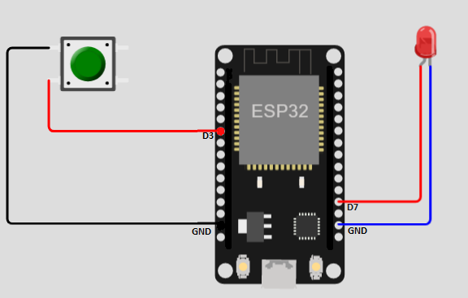

# IoT controlling LED with ESP8266 NodeMCU with on demand wifi configuration

A simple electronic configuration to control LED light using the internet with the help od
ESP8266 module (NodeMCU). Additional to the traditional LED control with Wifi, this project has a 
dynamic on demand wifi configuration to set and reset SSID and password for the IoT device.

## Acknowledgements

 - Library and Idea came from [ @tzapu](https://github.com/tzapu/WiFiManager)
 - An awesome video to see of [High Voltages: Esp8266 connect WIFI without hard coding credentials (SSID, Password)](https://www.youtube.com/watch?v=VKqr-RDmRpY)
## Circuit Design

## Installation

Install Arduino IDE from [arduino.cc](https://www.arduino.cc/en/software)

Set up your IDE to work with ESP modules. [circuits4you](https://circuits4you.com/2018/02/05/esp8266-arduino-wifi-web-server-led-on-off-control/)
is a great website that has helped me with it.

you can follow the video from Acknowledgements section for first time configuration.

This works with the ESP8266 Arduino platform

https://github.com/esp8266/Arduino

This works with the ESP32 Arduino platform

https://github.com/espressif/arduino-esp32    
## 🚀 About Me
Hi...
I am [Md. Afraim Bin Zahangir](https://github.com/Afraim). Fresh CSE Gradute from university of Liberal Arts Bangladesh. Although I am a CSE student but working with Arduino and electronics is my hobby and I like to make things that I, myslef and others will use. If you have any idea that you think we can work together, feel free to knock me 😁.

